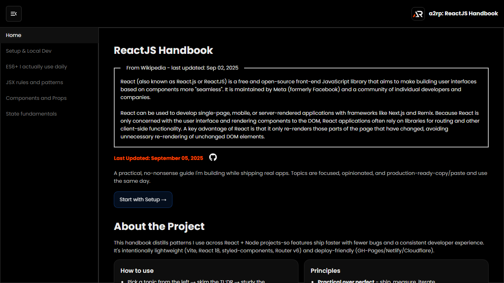

# ReactJS Handbook

A practical React reference with bite-sized topics, expandable examples, and reusable patterns for day-to-day frontend work.

## Features

- React fundamentals, JSX, props, state, and component patterns
- Hooks, events, forms, setup, ES6+, and practical examples
- Expandable topic sections with route-based navigation
- Responsive sidebar, theme-ready layout, and scroll-to-top controls

## Tech stack

React, Vite, React Router, Material UI, React Icons, and styled-components.

## Run locally

~~~bash
npm install
npm run dev
~~~

Build and deploy:

~~~bash
npm run build
npm run deploy
~~~

## Links

- Live: [https://a2rp.github.io/reactjs-handbook/](https://a2rp.github.io/reactjs-handbook/)
- Repository: [https://github.com/a2rp/reactjs-handbook](https://github.com/a2rp/reactjs-handbook)
- Portfolio: [https://www.ashishranjan.net/](https://www.ashishranjan.net/)
- GitHub: [https://github.com/a2rp](https://github.com/a2rp)
- CodePen: [https://codepen.io/ash1198](https://codepen.io/ash1198)
- LinkedIn: [https://www.linkedin.com/in/aashishranjan](https://www.linkedin.com/in/aashishranjan)
- Facebook: [https://www.facebook.com/theash.ashish/](https://www.facebook.com/theash.ashish/)
- YouTube: [https://www.youtube.com/@ashishranjan-ashz?sub_confirmation=1](https://www.youtube.com/@ashishranjan-ashz?sub_confirmation=1)
- Email: [ash.ranjan09@gmail.com](mailto:ash.ranjan09@gmail.com)

## Support

- [Support](https://a2rp-donation-page.netlify.app/)
- [Buy Me a Coffee](https://buymeacoffee.com/a2rp)
- [Patreon](https://patreon.com/a2rp)
